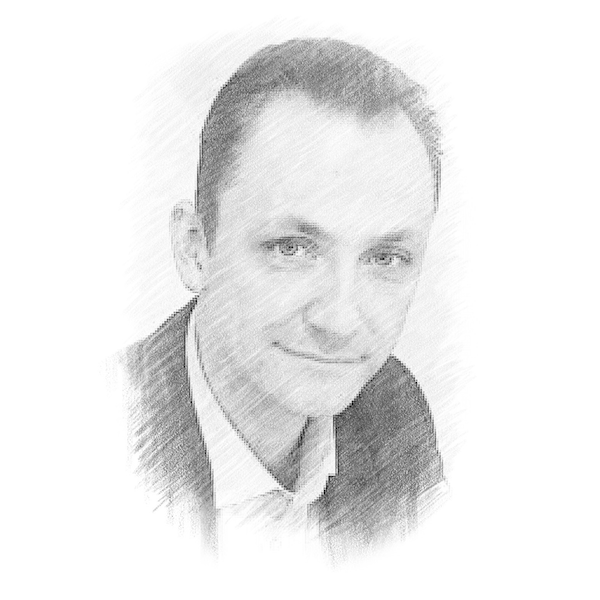

# Руслан Долгополов

###### Дата рождения
27.04.1981
###### Место проживания
г. Анапа
###### Гражданство
РФ
###### Контактные данные
+7(978)593-90-73

rusdolg@gmail.com
## Предпочитаемая должность
Java-разработчик
## Образование
### Курсы переподготовки
ООО "ЦОО Нетология-групп", 2022г. Специальность: [Java-разработчик](docs/JavaDeveloper.pdf)
### Дополнительные курсы
ООО "ЦОО Нетология-групп", 2021г. [Основы вёрстки сайта](docs/HTMLBasic.pdf) 
### Высшее образование
Московский гуманитарно-экономический институт, 2003г. Специальность: Юрист.

## Навыки
+ Знание ООП
+ JavaSE 11
+ JavaFX 18
+ Java Core
+ Maven, Gradle
+ Unit-тесты
+ Использование паттернов
+ Git
+ SQL-запросы
+ HTML, CSS
+ Bash
+ Intellij IDEA, Netbeans
+ Создание приложений для MacOS на Java

## О себе
Увлекаюсь информационными технологиями, обладаю техническими навыками работы в различных Unix-системах (от Linux, до MacOS и Android). Опыт создания игровых модов для ПК. В данный момент интересно развитие в сфере языков программирования.
В процессе обучение и по его окончании разработал несколько приложения (раздел Проекты).

Без опыта работы.
#### Знание языков
+ Русский (родной)
+ Английский (средний уровень, перевод "с листа")
+ Французский (начальный)
#### Личные качества
+ Усердие
+ Терпение
+ Настойчивость в достижении цели/решения задачи
+ Инициативность
+ Генератор идей
+ Стремление к оптимизации и автоматизации процессов
+ Коммуникабельность

## Проекты
[Radio Online](https://github.com/RusMansur/RadioOnline)

< Позднее будут добавлены другие проекты >
